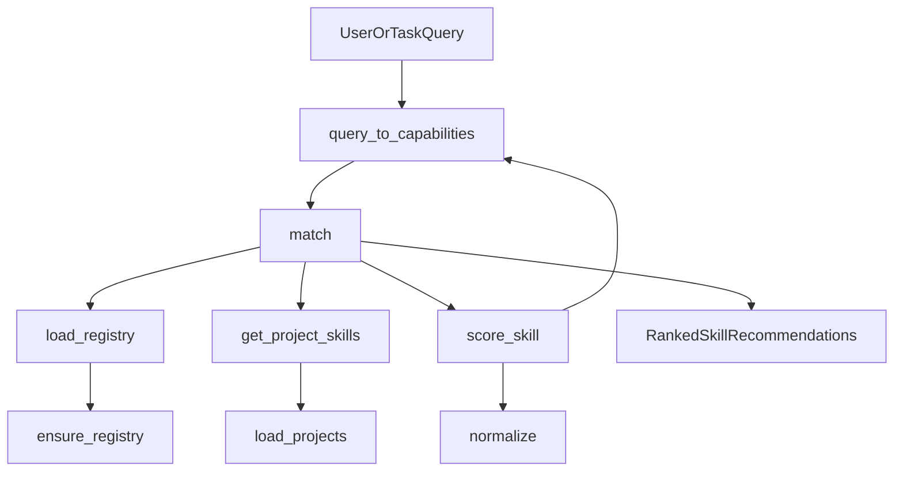

Operational Signals
- `matchLatencyMs`: time spent in `match`.
- `registryLoadMs`: time spent in `load_registry`.
- `scoringCount`: number of skills scored per query.
- `topSkillConfidence`: highest ranked score for observability.
