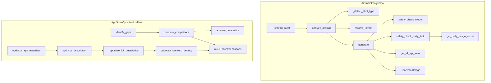

```mermaid
flowchart TD
  subgraph aiStudioImage [AiStudioImageFlow]
    ai_receive_prompt[PromptRequest]
    ai_analyze_prompt[analyze_prompt]
    ai_detect_shot_type[_detect_shot_type]
    ai_resolve_format[resolve_format]
    ai_validate_model_safety[safety_check_model]
    ai_validate_daily_limit[safety_check_daily_limit]
    ai_read_daily_usage[get_daily_usage_count]
    ai_fetch_api_keys[get_all_api_keys]
    ai_generate_image[generate]
    ai_return_image[GeneratedImage]
  end

  subgraph asoTools [AppStoreOptimizationFlow]
    aso_optimize_metadata[optimize_app_metadata]
    aso_optimize_description[optimize_description]
    aso_optimize_full_description[_optimize_full_description]
    aso_calculate_keyword_density[calculate_keyword_density]
    aso_identify_gaps[identify_gaps]
    aso_compare_competitors[compare_competitors]
    aso_analyze_competitor[analyze_competitor]
    aso_return_recommendations[ASORecommendations]
  end

  ai_receive_prompt --> ai_analyze_prompt
  ai_analyze_prompt --> ai_detect_shot_type
  ai_analyze_prompt --> ai_resolve_format
  ai_analyze_prompt --> ai_generate_image
  ai_generate_image --> ai_validate_model_safety
  ai_generate_image --> ai_validate_daily_limit
  ai_validate_daily_limit --> ai_read_daily_usage
  ai_generate_image --> ai_fetch_api_keys
  ai_generate_image --> ai_return_image

  aso_optimize_metadata --> aso_optimize_description
  aso_optimize_description --> aso_optimize_full_description
  aso_optimize_full_description --> aso_calculate_keyword_density
  aso_identify_gaps --> aso_compare_competitors
  aso_compare_competitors --> aso_analyze_competitor
  aso_compare_competitors --> aso_return_recommendations
  aso_calculate_keyword_density --> aso_return_recommendations
```

Operational Signals
- `imageGenSuccessRate`
- `dailyLimitRejectionCount`
- `asoRunDurationMs`
- `keywordCoverageScore`
