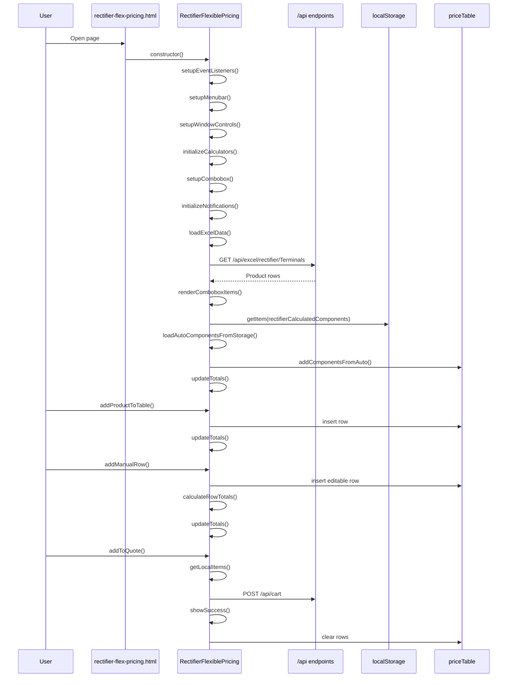

```mermaid
sequenceDiagram
  participant User
  participant Page as rectifier-flex-pricing.html
  participant App as RectifierFlexiblePricing
  participant Api as /api endpoints
  participant Storage as localStorage
  participant Table as priceTable

  User->>Page: Open page
  Page->>App: constructor()
  App->>App: setupEventListeners()
  App->>App: setupMenubar()
  App->>App: setupWindowControls()
  App->>App: initializeCalculators()
  App->>App: setupCombobox()
  App->>App: initializeNotifications()
  App->>App: loadExcelData()
  App->>Api: GET /api/excel/rectifier/Terminals
  Api-->>App: Product rows
  App->>App: renderComboboxItems()
  App->>Storage: getItem(rectifierCalculatedComponents)
  App->>App: loadAutoComponentsFromStorage()
  App->>Table: addComponentsFromAuto()
  App->>App: updateTotals()

  User->>App: addProductToTable()
  App->>Table: insert row
  App->>App: updateTotals()

  User->>App: addManualRow()
  App->>Table: insert editable row
  App->>App: calculateRowTotals()
  App->>App: updateTotals()

  User->>App: addToQuote()
  App->>App: getLocalItems()
  App->>Api: POST /api/cart
  App->>App: showSuccess()
  App->>Table: clear rows
```
