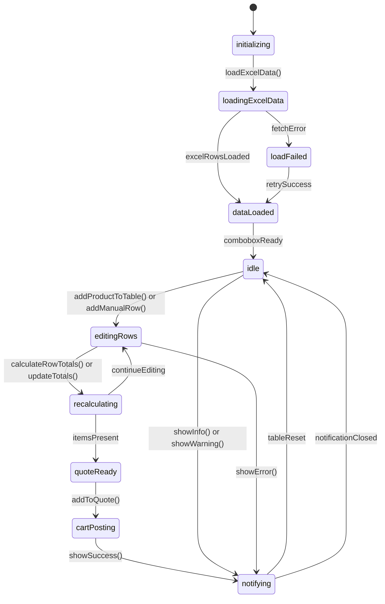

```mermaid
stateDiagram-v2
  [*] --> initializing
  initializing --> loadingExcelData: loadExcelData()
  loadingExcelData --> dataLoaded: excelRowsLoaded
  loadingExcelData --> loadFailed: fetchError
  loadFailed --> dataLoaded: retrySuccess

  dataLoaded --> idle: comboboxReady
  idle --> editingRows: addProductToTable() or addManualRow()
  editingRows --> recalculating: calculateRowTotals() or updateTotals()
  recalculating --> editingRows: continueEditing
  recalculating --> quoteReady: itemsPresent
  quoteReady --> cartPosting: addToQuote()
  cartPosting --> notifying: showSuccess()
  notifying --> idle: tableReset

  idle --> notifying: showInfo() or showWarning()
  editingRows --> notifying: showError()
  notifying --> idle: notificationClosed
```
