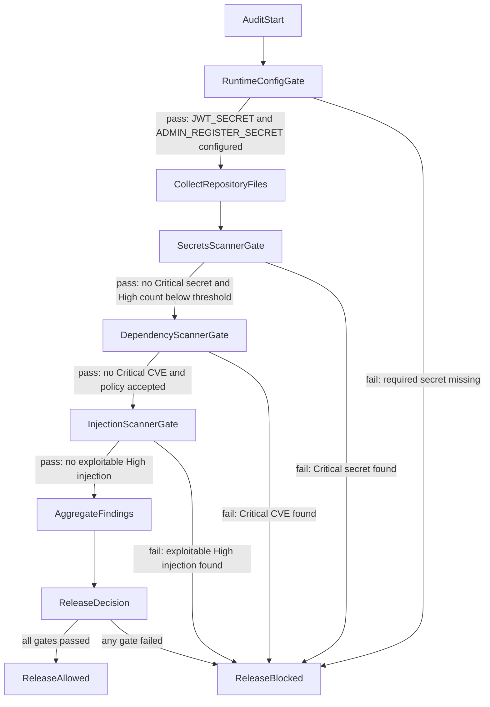

Gate Contract
- `SecretsScannerGate`
  - Trigger: every commit or CI release candidate.
  - Fail: `criticalCount >= 1` OR `highCount >= 3`.
  - Pass: `criticalCount = 0` AND `highCount < 3`.
- `DependencyScannerGate`
  - Trigger: after secrets gate passes.
  - Fail: `criticalCveCount >= 1` OR `highCveCount >= 5`.
  - Pass: `criticalCveCount = 0` AND `highCveCount < 5`.
- `InjectionScannerGate`
  - Trigger: after dependency gate passes.
  - Fail: `exploitableHigh >= 1`.
  - Pass: `exploitableHigh = 0`.

Artifacts
- `secrets_report.json`
- `dependency_report.json`
- `injection_report.json`
- `audit_summary.json`

Security Posture Notes
- Default admin auto-seeding is disabled; privileged accounts must be provisioned through controlled flows.
- Missing required runtime secrets are treated as release-blocking misconfiguration.
